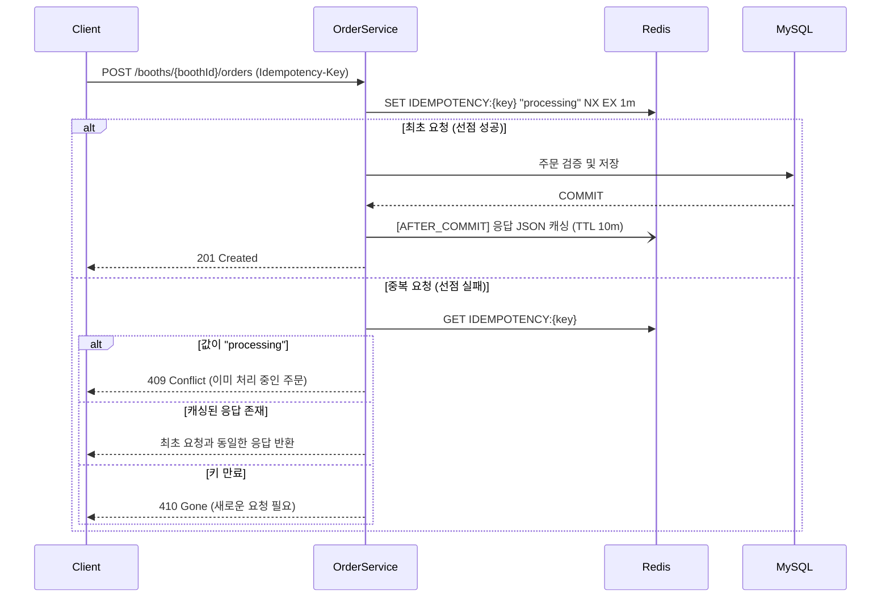
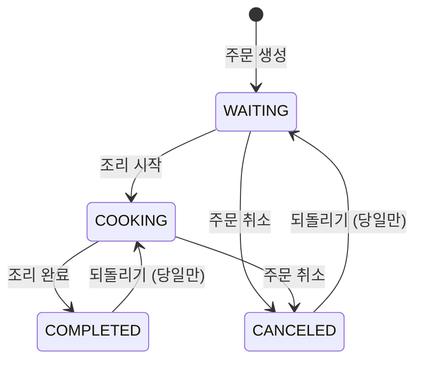

# 서경대학교 멋쟁이사자처럼 14기 홈페이지 레포지토리입니다.


1. [Intro](#intro)
2. [System Architecture](#system_architecture)
3. [ERD](#erd)
4. [Package Structure](#package_structure)
5. [Assigned Tasks](#assigned_tasks)
6. [API Documentation](#api_documentation)

---

## Intro


> **기간**: 2026.04 ~ 2025.05
>

> **팀 구성**: PO 4명, FE 4명, BE 3명
>

> **역할**: 주문 기능 백엔드 개발, 회원·인증 기능 백엔드 개발 인프라 관리
>

### 목적

- 서경대학교 대동제의 일정, 공연 라인업, 부스 위치 등 축제 정보를 한곳에서 제공하여 재학생과 외부 방문객의 정보 접근성을 높이고 축제에 대한 관심과 참여를 이끌어낸다.
- 축제 주점의 종이 주문서를 웹 기반 주문 시스템으로 대체하여 주문 누락, 판독 오류, 계산 실수 등의 문제를 해결하고, 고객과 운영진 모두에게 빠르고 편리한 주문 경험을 제공한다.


---

### 주문 기능 핵심 설계 및 구현

> 축제 주점은 짧은 시간에 주문이 몰리고, 운영진은 여러 기기에서 동시에 주문 현황을 확인합니다.
> 그래서 **① 중복 주문 방지**, **② 실시간 상태 동기화**, **③ 데이터 정합성**, **④ 조회 성능**을 핵심 목표로 설계했습니다.

<br>

#### 1. Redis 기반 멱등성(Idempotency) 처리 — 중복 주문 방지

네트워크 지연이나 버튼 연타로 같은 주문이 여러 번 들어오는 상황을 막기 위해, 클라이언트가 발급한 `Idempotency-Key` 헤더를 기준으로 요청을 한 번만 처리합니다.



| 단계 | 동작 | 설계 의도 |
|------|------|-----------|
| 키 선점 | `setIfAbsent` (Redis `SET NX`) + TTL **1분** | 원자적 연산으로 동시에 들어온 요청 중 **단 하나만** 처리 권한 획득 |
| 처리 중 재요청 | `processing` 상태 감지 → `409 CONFLICT` | 처리 중인 주문이 중복 생성되는 것을 차단 |
| 처리 완료 후 재요청 | 캐싱된 `OrderResponse` 역직렬화 후 반환 | 클라이언트는 재시도해도 **항상 같은 결과**를 받음 |
| 응답 캐싱 | 트랜잭션 **커밋 이후** 응답 저장, TTL **10분** | DB에 실제로 반영된 주문만 캐싱 (롤백된 주문 캐싱 방지) |
| 실패 처리 | 예외 발생 / 캐싱 실패 시 `deleteKey` | 실패한 요청이 키를 점유해 정상 재시도를 막지 않도록 복구 |

<br>

#### 2. SSE 기반 실시간 주문 알림 — 구독 타입별 Emitter 관리

운영진 화면은 `대기중 / 조리중 / 완료 / 취소` 탭으로 나뉘어 있고, 여러 기기가 서로 다른 탭을 보고 있을 수 있습니다.
폴링 대신 **단방향 서버 푸시(SSE)** 를 사용하고, Emitter를 **부스 + 구독 타입(탭)** 단위로 분리해 필요한 화면에만 이벤트를 전달합니다.

```java
// OrderSseEmitterRepository
Map<Long, Map<SseSubscribeType, List<SseEmitter>>> emitters = new ConcurrentHashMap<>();
//  └ boothId  └ WAITING / COOKING / COMPLETED / CANCELED   └ CopyOnWriteArrayList
```

- **`ConcurrentHashMap` + `CopyOnWriteArrayList`**: 다수의 관리자 기기가 동시에 구독/해제하고, 이벤트 전송(순회)이 빈번한 환경에서 별도 락 없이 스레드 안전성 확보
- **부스 단위 격리**: 다른 학과 부스의 주문 이벤트는 전달되지 않음
- **연결 생명주기 관리**: `onCompletion` / `onTimeout` / `onError` 콜백과 전송 실패(`IOException`) 시 Emitter를 즉시 제거하고, 빈 Map/List도 정리해 메모리 누수 방지
- **구독 권한 검증**: JWT 인증된 부스 관리자만 자신의 부스를 구독 가능 (`BOOTH_MANAGER`)

**이벤트 전달 방식**

주문 상태가 바뀌면 "해당 탭에 주문 데이터 추가" + "이전 탭에서 주문 제거" + "다른 탭의 뱃지 카운트 갱신"이 함께 일어나야 합니다.

| 이벤트 | 수신 대상 | 용도 |
|--------|-----------|------|
| `waitingOrderEvent` / `cookingOrderEvent` / `completedOrderEvent` / `canceledOrderEvent` | **변경된 상태**의 탭 구독자 | 새 주문 카드 데이터 전달 |
| `dismissNotification` | **이전 상태**의 탭 구독자 | 해당 탭 목록에서 주문 제거 |
| `orderIncrementNotification` | 변경된 상태 탭을 **제외한** 구독자 | 다른 탭에 있는 관리자의 알림 뱃지 +1 |
| `orderDecrementNotification` | 이전 상태 탭을 **제외한** 구독자 | 다른 탭에 있는 관리자의 알림 뱃지 -1 |
| `orderItemUnitStatusEvent` | 조리중 탭 구독자 | 메뉴 단위 서빙 완료 체크 동기화 |

```
예) 주문 #12 를 대기중 → 조리중 으로 변경
 ├─ COOKING 탭      ← cookingOrderEvent         (조리중 목록에 #12 추가)
 ├─ WAITING 탭      ← dismissNotification       (대기중 목록에서 #12 제거)
 ├─ COOKING 외 탭   ← orderIncrementNotification (조리중 카운트 +1)
 └─ WAITING 외 탭   ← orderDecrementNotification (대기중 카운트 -1)
```

<br>

#### 3. `@TransactionalEventListener(AFTER_COMMIT)` — 커밋 이후 알림 전송

서비스 계층은 SSE·Redis를 직접 호출하지 않고 `ApplicationEventPublisher`로 **이벤트(Payload)만 발행**합니다.
`OrderEventListener`가 트랜잭션 **커밋이 완료된 이후**에만 SSE 전송과 멱등성 응답 캐싱을 수행합니다.

```mermaid
flowchart LR
    A[OrderService<br/>@Transactional] -->|publishEvent<br/>WaitingOrderPayload 등| B((Spring Event))
    A --> C[(DB COMMIT)]
    C -->|AFTER_COMMIT| D[OrderEventListener]
    D --> E[OrderSseService<br/>SSE 전송]
    D --> F[OrderIdempotencyService<br/>응답 캐싱]
```

- **정합성 보장**: 트랜잭션이 롤백되면 이벤트도 실행되지 않으므로, *DB에 없는 주문이 운영진 화면에 노출되는* 유령 알림이 발생하지 않음
- **장애 격리**: SSE 전송 실패(연결 끊김 등)가 주문 저장 트랜잭션을 롤백시키지 않음
- **관심사 분리**: 주문 비즈니스 로직과 알림/캐싱 로직이 분리되어, 알림 방식이 바뀌어도 서비스 코드는 영향을 받지 않음

<br>

#### 4. DTO 프로젝션 조회 — N+1 문제 방지 및 조회 최적화

운영진 화면은 SSE 재연결이나 탭 전환 시 목록을 자주 다시 조회합니다. 엔티티를 그대로 조회하면 연관 엔티티(`OrderItem`, `BoothMenu`) 접근 시 **N+1 문제**가 발생하므로, JPQL `new` 생성자 표현식으로 **필요한 컬럼만 DTO로 직접 조회**했습니다.

```java
@Query("""
    SELECT new ...WaitingOrderItemResponse(oi.id, oi.order.id, bm.nameKo, oi.quantity, oi.totalOrderItemPrice)
    FROM OrderItem oi
    JOIN oi.boothMenu bm
    WHERE oi.order.id IN :orderIds
""")
List<WaitingOrderItemResponse> findWaitingOrderItemsByOrderIds(List<Long> orderIds);
```

**2단계 조회 + 메모리 그룹핑** 으로 주문 개수와 무관하게 쿼리 수를 고정했습니다.

```
① 주문 목록 DTO 조회          SELECT DISTINCT new WaitingOrderResponse(...)   → 1회
② 주문 ID 목록으로 항목 조회   SELECT new WaitingOrderItemResponse(...) WHERE oi.order.id IN (...) → 1회
③ groupingBy(orderId) 후 각 주문 DTO 에 항목 매핑 (애플리케이션 메모리)
```

- 영속성 컨텍스트에 엔티티를 올리지 않아 **불필요한 스냅샷/더티체킹 비용 제거** (`@Transactional(readOnly = true)`)
- 탭(대기/조리/완료/취소)마다 필요한 필드가 다르므로 **탭 전용 DTO**로 분리
- 완료/취소 탭은 날짜·주문자명·전화번호 키워드 필터를 쿼리 단에서 처리
- 매출 조회는 `SUM` 집계 + `EXISTS` 서브쿼리로 DB에서 바로 계산

<br>

#### 5. 그 외 설계 포인트

**주문 상태 전이 규칙 (상태 패턴 Enum)**

`OrderStatus` 각 상수가 `canChangeTo()`를 직접 구현해, 허용되지 않은 상태 전이를 도메인 레벨에서 차단합니다.



- 실수로 잘못 누른 상태를 복구할 수 있도록 되돌리기를 허용하되, **지난 날짜의 주문은 되돌릴 수 없도록** 제한해 정산 데이터를 보호
- 같은 상태로의 변경 요청은 이벤트를 발행하지 않고 무시 (중복 알림 방지)

**메뉴 개별 단위(`OrderItemUnit`) 서빙 관리**

`메뉴 A × 3` 주문을 `OrderItemUnit` 3개로 분리 저장해, 조리중 탭에서 **메뉴 하나하나의 서빙 완료 여부**를 체크하고 SSE로 다른 기기와 동기화합니다. 서빙 체크는 **조리중 상태의 주문에서만** 가능하도록 검증합니다.

**서버 측 주문 검증**

클라이언트가 보낸 값을 신뢰하지 않고 주문 저장 전에 아래 항목을 모두 검증합니다.

- 부스 존재 여부 / 주문 기능 사용 여부 / 영업 중(`OPEN`) 여부
- 요청 메뉴 존재 여부, 품절 여부, **현재 운영 시간대에 주문 가능한 메뉴인지**
- 메뉴 가격이 실제 DB 가격과 일치하는지
- `메뉴 가격 × 수량 = 항목 총액`, `Σ 항목 총액 = 주문 총액` 일치 여부


## System_Architecture


---

## ERD


---

## Package_Structure

- 도메인 계층형 혼합 패키지 구조를 통해서 프로젝트 전체 구조를 쉽게 파악하고, 협업에 용이하도록 구성했습니다.

```
com.skunivlikelion.festival
├── domain
│   ├── auth
│   ├── booth
│       ├── form
│       ├── question
│       ├── record
│       └── result
│   ├── lostitem
│       ├── booking
│       └── schedule
│   ├── manager
│   └── order
├── global
│   ├── annotation
│   ├── aspect
│   ├── common
│   ├── config
│       └── property
│   ├── exception
│   ├── filter
│   ├── s3
│   └── security
│       └── jwt

```

---

## Assigned_Tasks

| Feature  | BE assignee                                        |
|----------|----------------------------------------------------|
| 주문 기능    | [@silversieon](https://github.com/silversieon)     |
| 인증 기능    | @silversieon                                       |
| 회원 기능    | @silversieon                                       |
| 분실물 기능   | [@shinchaerin79](https://github.com/shinchaerin79) |
| 이미지 관련 기능 | @shinchaerin79                                     |
| 부스 기능    | [@naooung](https://github.com/naooung)             |
| 부스 메뉴 기능 | @naooung                                           |
| 부스 번역 기능 | @naooung                                           |

---
